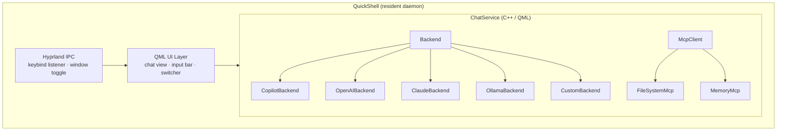

# Architecture

High-level system overview for HyprChat.

## System Diagram

## Components

| Component | Role |
| --------- | ---- |
| **QuickShell** | Resident Hyprland shell. Manages Wayland surfaces, keybind IPC, and the QML runtime. Stays alive between invocations. |
| **Hyprland IPC** | Listens on the Hyprland socket for keybind dispatch. Toggles panel visibility without spawning a new process. |
| **QML UI** | Declarative UI layer. Qt Quick components for the chat view, input, and backend switcher. |
| **ChatService** | Orchestrates conversations. Routes messages to the active backend, manages chat history, handles streaming, and runs the tool-use loop. Implemented in C++ and exposed to QML via properties/signals. |
| **Backend** | Abstract base for LLM providers. Each subclass handles auth, request format, streaming, and tool-call parsing for its API. Translates a common tool definition format into the provider's wire format. |
| **McpClient** | Connects to local MCP servers over stdio. Discovers available tools at startup and executes tool calls on behalf of `ChatService`. |

## Tech Stack

| Layer | Choice | Reason |
| ----- | ------ | ------ |
| Shell | QuickShell | Native Hyprland integration, resident daemon, layer-shell surfaces |
| UI | Qt6 QML / Qt Quick | Declarative, fast, native rendering, no WebView |
| Backend logic | C++ (Qt6) | Performance, direct access to Qt networking and process APIs |
| HTTP | `QNetworkAccessManager` | Built-in, supports chunked/streaming responses |
| JSON | `QJsonDocument` | Built-in, no external dependencies |
| Process mgmt | `QProcess` | Spawn and communicate with MCP servers over stdio |
| Markdown | `TextEdit.MarkdownText` | Built-in Qt 6.5+ markdown rendering, no external library |
| IPC | Hyprland socket | Direct compositor communication for keybinds and window control |

## Open Questions

- **Copilot auth**: Can we reliably use `gh auth token` for the
  GitHub Models API, or do we need a separate OAuth flow?
- **Markdown rendering**: Qt's built-in markdown is reasonable but
  limited (no syntax highlighting in code blocks). Worth bundling
  a JS highlighter via `WebEngineView` for code, or keep it simple?
- **MCP transport**: stdio via `QProcess` is the simplest path.
  Alternatively, connect to already-running MCP servers over HTTP/SSE.
- **Pure QML vs C++ plugin**: Simple backends could be implemented
  entirely in QML/JS using `XMLHttpRequest`. Reserve C++ for
  streaming and MCP? Or keep all logic in C++ for consistency?
- **QuickShell version**: Pin to a specific QuickShell release or
  track latest? API stability is still evolving.
