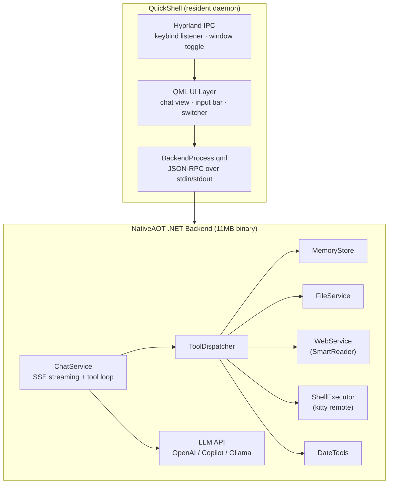

# Architecture

High-level system overview for HyprChat.

## System Diagram



## Components

| Component | Role |
| --------- | ---- |
| **QuickShell** | Resident Hyprland shell. Manages Wayland surfaces, keybind IPC, and the QML runtime. Stays alive between invocations. |
| **QML UI** | Declarative UI layer. Qt Quick components for the chat view, input, backend switcher, memory viewer, and preferences. |
| **BackendProcess** | QML component that manages the NativeAOT backend binary. Communicates via newline-delimited JSON-RPC over stdin/stdout. |
| **ChatService** | .NET service that streams chat completions via `HttpClient`. Handles SSE parsing, tool call accumulation, and the full tool-use loop internally. |
| **ToolDispatcher** | Routes tool calls to the appropriate service and returns results. |
| **MemoryStore** | Encrypted persistent memory. AES-256-CBC with PBKDF2, key in system keyring. |
| **FileService** | Read/write file access scoped to allowed root directories. |
| **WebService** | Web search via DuckDuckGo + page extraction via SmartReader. |
| **ShellExecutor** | Shell command execution via kitty remote control. |
| **ModelFetcher** | Fetches available models from Copilot, OpenAI, and Ollama APIs. |
| **KeyringService** | Manages secrets in the system keyring via `secret-tool`. |

## Tech Stack

| Layer | Choice | Reason |
| ----- | ------ | ------ |
| Shell | QuickShell | Native Hyprland integration, resident daemon |
| UI | Qt6 QML / Qt Quick | Declarative, fast, native rendering, no WebView |
| Backend | .NET 10 NativeAOT | Single 11MB binary, no runtime deps, proper async, `HttpClient` for SSE |
| JSON | `System.Text.Json` source generators | AOT-safe, zero reflection |
| Web scraping | SmartReader + AngleSharp | Readability.js equivalent, no Node.js |
| IPC | stdin/stdout JSON-RPC | Simple, no sockets or ports |
| Markdown | `TextEdit.MarkdownText` | Built-in Qt 6.5+ |

## Project Structure

```
src/
  hyprchat-ui/       # QML frontend (QuickShell)
    shell.qml        # Entry point
    ChatWindow.qml   # Main window + orchestration
    BackendProcess.qml # JSON-RPC bridge to backend
    ChatView.qml     # Message list
    MessageBubble.qml # Single message
    InputBar.qml     # Text input
    MemoryView.qml   # Memory browser
    PreferencesView.qml # Settings UI
    ...
  hyprchat-backend/  # C# NativeAOT backend
    Program.cs       # Entry point + JSON-RPC dispatcher
    Chat/            # ChatService, SystemPromptBuilder
    Protocol/        # RpcTransport, Types
    Services/        # MemoryStore, FileService, WebService, ShellExecutor, etc.
    Tools/           # ToolDefinitions, ToolDispatcher
    Publish/         # Published NativeAOT binary
```
