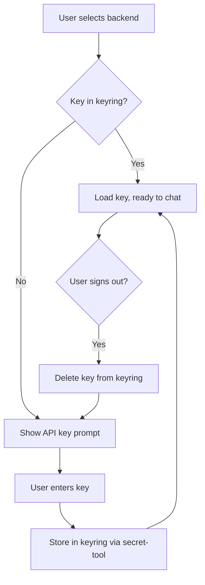

# Authentication

API key management for LLM backends.

## Overview

HyprChat stores API keys in the system keyring via the freedesktop
Secret Service API (`secret-tool` / libsecret). No keys are stored
in config files, environment variables, or on disk in plaintext.

Compatible Secret Service providers:
- GNOME Keyring
- KeePassXC (with Secret Service integration)
- KDE Wallet (via `org.kde.secretservicecompat`)

## Key Storage

All entries use a common schema:

| Attribute | Value |
| --------- | ----- |
| `service` | `hyprchat` |
| `account` | backend name (e.g. `openai`, `claude`, `copilot`) |

### First-Time Setup

When a backend is selected that requires an API key and none is found
in the keyring, HyprChat shows an inline prompt in the chat window
asking the user to enter the key. The key is then stored in the
keyring automatically.

No CLI commands or manual keyring setup required.

### Manual Management (CLI)

Keys can also be managed via `secret-tool` directly:

```bash
# Store a key
echo -n "sk-..." | secret-tool store --label="HyprChat openai" service hyprchat account openai

# Retrieve a key
secret-tool lookup service hyprchat account openai

# Delete a key
secret-tool clear service hyprchat account openai
```

## Sign Out / Replace Key

HyprChat supports signing out of a backend, which deletes the stored
API key from the keyring and prompts for a new one.

This is exposed in the UI (backend switcher or a sign-out action) and
calls `KeyringService.remove(account)` under the hood, which runs:

```bash
secret-tool clear service hyprchat account <backend>
```

After deletion, the API key prompt reappears, allowing the user to
enter a different key.

Use cases:
- **Rotate an API key** — sign out, paste the new key
- **Switch accounts** — sign out of one provider, sign in with
  different credentials
- **Revoke access** — remove the key entirely

## Flow



## Per-Backend Auth

| Backend | Auth method |
| ------- | ----------- |
| **OpenAI** | API key from keyring (`account: openai`) |
| **Claude** | API key from keyring (`account: claude`) |
| **GitHub Copilot** | API key from keyring (`account: copilot`), or `gh auth token` |
| **Ollama** | None — local, no key needed |
| **Custom** | API key from keyring (`account: custom`) |

Backends that don't require authentication (like Ollama) skip the
keyring lookup entirely.

## Security

- Keys are stored in the system keyring, encrypted at rest by the
  Secret Service provider
- Keys are never written to config files or logs
- Keys are held in memory only for the lifetime of the process
- The `secret-tool` commands are the only external processes invoked
  for key management — no custom crypto
