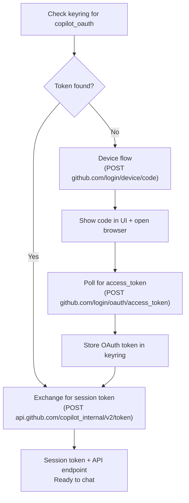

# Authentication

API key management for LLM backends.

## Overview

HyprChat stores API keys and OAuth tokens in the system keyring via
the freedesktop Secret Service API (`secret-tool` / libsecret). No
keys are stored in config files, environment variables, or on disk
in plaintext.

## Keyring Setup (Required)

HyprChat requires a running Secret Service provider. The recommended
provider for Hyprland is **GNOME Keyring** — it works headlessly
(no GUI prompts), auto-unlocks via PAM, and is widely compatible.

### Install

```bash
# Arch / CachyOS
sudo pacman -S gnome-keyring libsecret
```

### PAM Auto-Unlock

Add to `/etc/pam.d/login` (and your display manager's PAM config,
e.g. `greetd`, `sddm`):

```txt
auth       optional     pam_gnome_keyring.so
session    optional     pam_gnome_keyring.so auto_start
```

This unlocks the keyring automatically when you log in — no password
prompts.

### Start the Daemon

Add to your Hyprland config (`hyprland.conf`):

```conf
exec-once = gnome-keyring-daemon --start --components=secrets
```

### KDE Wallet Conflict

If KDE Wallet (`kwalletd6` / `ksecretd`) is installed, it may claim
the `org.freedesktop.secrets` DBus name before gnome-keyring can.
To prevent this, override the DBus activation service:

```bash
mkdir -p ~/.local/share/dbus-1/services
cat > ~/.local/share/dbus-1/services/org.freedesktop.secrets.service << 'EOF'
[D-BUS Service]
Name=org.freedesktop.secrets
Exec=/usr/bin/gnome-keyring-daemon --start --components=secrets
EOF
```

This ensures gnome-keyring always wins the `org.freedesktop.secrets`
name, regardless of what other providers are installed.

## Key Storage

All entries use a common schema:

| Attribute | Value |
| --------- | ----- |
| `service` | `hyprchat` |
| `account` | backend name (e.g. `openai`, `claude`, `copilot_oauth`) |

### First-Time Setup

When a backend is selected that requires an API key and none is found
in the keyring, HyprChat shows an inline prompt in the chat window
asking the user to enter the key. The key is then stored in the
keyring automatically.

For GitHub Copilot, HyprChat runs an OAuth device flow instead —
no API key needed, just authorize in the browser.

### Manual Management (CLI)

Keys can also be managed via `secret-tool` directly:

```bash
# Store a key
printf "sk-..." | secret-tool store --label="HyprChat openai" service hyprchat account openai

# Retrieve a key
secret-tool lookup service hyprchat account openai

# Delete a key
secret-tool clear service hyprchat account openai
```

## GitHub Copilot Auth

Copilot uses a multi-step OAuth flow, not a simple API key:



1. **OAuth token** (`ghu_...`) — long-lived, stored in keyring as
   `copilot_oauth`. Obtained via GitHub device flow with the Copilot
   app (`client_id: Iv1.16516584648`).
2. **Session token** — short-lived, obtained by exchanging the OAuth
   token at `api.github.com/copilot_internal/v2/token`. This response
   also contains the API endpoint URL.
3. The session token is used for `/models` and `/chat/completions`.

## Sign Out / Replace Key

HyprChat supports signing out of a backend, which deletes the stored
API key from the keyring and prompts for a new one.

This is exposed in the UI (backend switcher or a sign-out action) and
calls `KeyringService.remove(account)` under the hood, which runs:

```bash
secret-tool clear service hyprchat account <backend>
```

After deletion, the API key prompt reappears (or the device flow
restarts for Copilot), allowing the user to enter different
credentials.

Use cases:

- **Rotate an API key** — sign out, paste the new key
- **Switch accounts** — sign out of one provider, sign in with
  different credentials
- **Revoke access** — remove the key entirely

## Per-Backend Auth

| Backend | Auth method |
| ------- | ----------- |
| **GitHub Copilot** | OAuth device flow → session token (keyring `account: copilot_oauth`) |
| **OpenAI** | API key from keyring (`account: openai`) |
| **Claude** | API key from keyring (`account: claude`) |
| **Ollama** | None — local, no key needed |
| **Custom** | API key from keyring (`account: custom`) |

Backends that don't require authentication (like Ollama) skip the
keyring lookup entirely.

## Security

- Keys are stored in the system keyring, encrypted at rest by the
  Secret Service provider
- Keys are never written to config files or logs
- Keys are held in memory only for the lifetime of the process
- The `secret-tool` commands are the only external processes invoked
  for key management — no custom crypto
- The Copilot OAuth token has `read:user` scope only — minimal
  permissions
