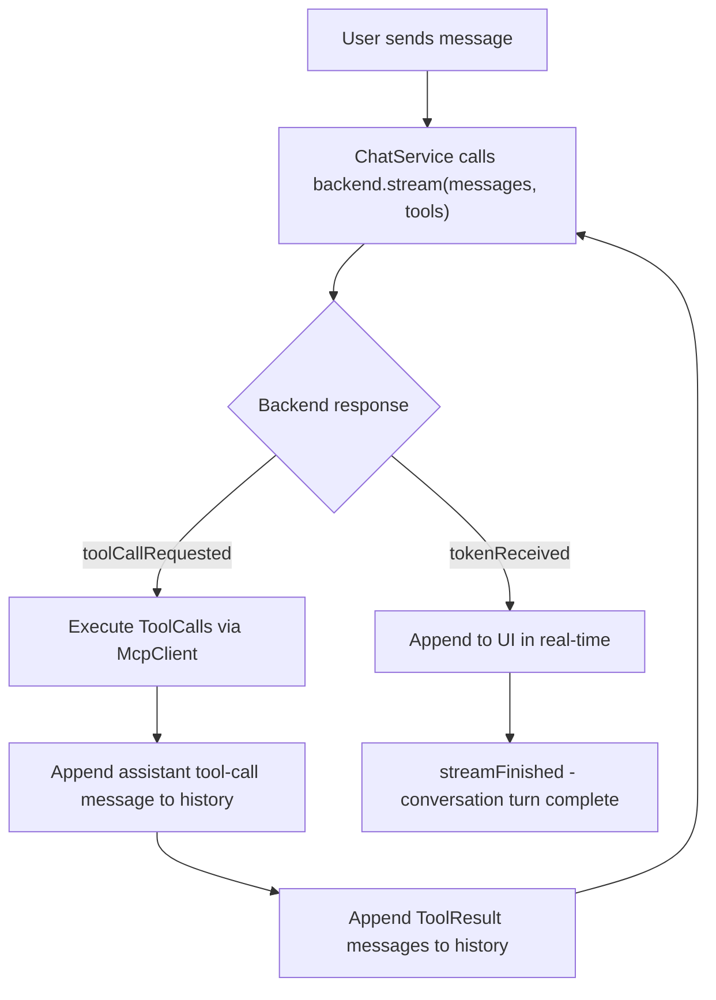

# Backend Implementation

ChatService, tool-use orchestration, and configuration.

## ChatService

`ChatService` is a C++ singleton exposed to QML. It orchestrates
conversations: routing messages to the active backend, managing chat
history, handling streaming responses, and running the tool-use loop.

### Responsibilities

- Maintain the current message list (`QList<ChatMessage>`)
- Hold a reference to the active `Backend` and switch on demand
- Collect `ToolDefinition` objects from `McpClient` at startup
- Pass tools to `backend.stream()` when the backend supports them
- Execute the tool-use loop when the LLM requests tool calls
- Expose properties and signals to QML for reactive UI binding

### Tool-Use Orchestration

When a backend emits `toolCallRequested`, `ChatService` executes each
tool via `McpClient`, collects the results, appends them to the message
history, and calls `stream()` again to let the LLM continue:



The loop has a configurable max iteration limit (default: 10) to
prevent runaway tool calls. If a backend reports `supportsTools()
== false`, `ChatService` omits tool definitions and the LLM operates
in plain text mode.

## Configuration

Single JSON config file at `~/.config/hyprchat/config.json`:

```json
{
  "active_backend": "copilot",
  "backends": {
    "copilot": {
      "model": "gpt-4o"
    },
    "openai": {
      "model": "gpt-4o",
      "api_key_env": "OPENAI_API_KEY"
    },
    "claude": {
      "model": "claude-sonnet-4-20250514",
      "api_key_env": "ANTHROPIC_API_KEY"
    },
    "ollama": {
      "model": "llama3",
      "url": "http://localhost:11434"
    }
  },
  "mcp": {
    "filesystem": {
      "roots": ["~/Dev", "~/Documents"]
    },
    "memory": {
      "path": "~/.config/hyprchat/memory"
    }
  },
  "system_prompt": "You are a helpful assistant. Be concise."
}
```

API keys are read from environment variables, never stored in the config.
Config is loaded once at daemon startup and exposed to QML as a
singleton context property via `ConfigService`.

## ConfigService

Loads and parses `config.json` using `QJsonDocument`. Exposes:

- Active backend name
- Per-backend settings (model, URL, API key env var name)
- MCP server configuration
- System prompt

Read-only at runtime. Changes require editing the JSON file and
restarting the daemon (or sending a reload signal).
