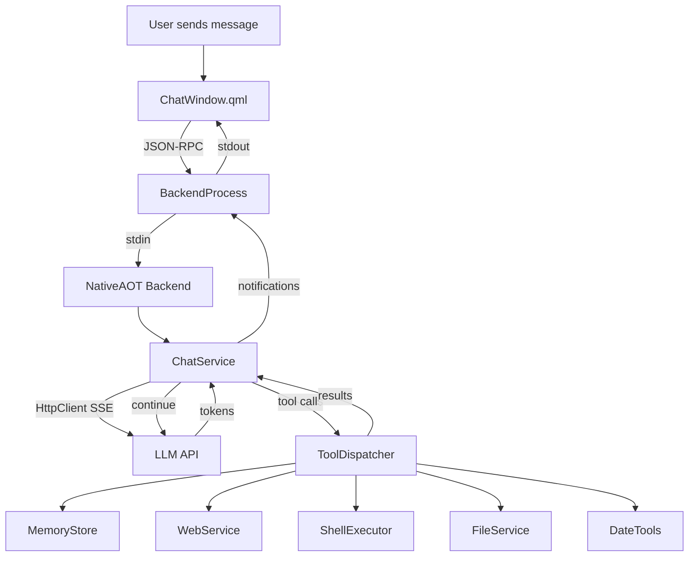

# Backend Implementation

How HyprChat orchestrates conversations, manages tools, and streams
responses.

## Architecture

The backend is a NativeAOT .NET 10 binary that communicates with the
QML frontend via newline-delimited JSON-RPC over stdin/stdout. It
owns the entire LLM interaction: streaming, tool execution loop,
memory, keyring, and model fetching.



## ChatService

`ChatService.cs` handles streaming chat completions from any
OpenAI-compatible API:

1. Builds system prompt via `SystemPromptBuilder`
2. Builds tool definitions via `ToolDefinitions`
3. Sends POST to the LLM API via `HttpClient`
4. Reads SSE stream line by line
5. Parses `delta.content` (tokens) and `delta.tool_calls`
6. Emits `chat/token` notifications for each token
7. On tool calls: executes via `ToolDispatcher`, appends results,
   loops back to the LLM
8. Emits `chat/finished` when done

### Tool-Use Loop

The backend owns the entire loop internally:

1. Stream response from the LLM
2. If tool calls present → execute each via `ToolDispatcher`
3. Notify QML about each tool call and result (for UI display)
4. Append tool results to message history
5. Re-send to LLM
6. Repeat until LLM responds with text only
7. Capped at 100 iterations

The QML frontend only renders — it never dispatches tools.

## JSON-RPC Protocol

### Requests (QML → Backend)

| Method | Description |
|--------|-------------|
| `chat/send` | Start a chat completion with tool loop |
| `chat/cancel` | Cancel the active stream |
| `models/fetch` | Fetch available models for a backend |
| `keyring/lookup` | Look up a secret from the keyring |
| `keyring/store` | Store a secret in the keyring |
| `keyring/delete` | Delete a secret from the keyring |
| `memory/list` | List memory topics (for MemoryView UI) |
| `memory/read` | Read a memory topic (for MemoryView UI) |
| `memory/edit` | Edit a memory topic (for MemoryView UI) |
| `memory/delete` | Delete a memory topic (for MemoryView UI) |

### Notifications (Backend → QML)

| Method | Description |
|--------|-------------|
| `ready` | Backend initialized |
| `chat/token` | Streamed token |
| `chat/toolCall` | Tool being executed |
| `chat/toolResult` | Tool result preview |
| `chat/usage` | Token usage stats |
| `chat/finished` | Stream complete |
| `chat/error` | Error occurred |
| `chat/tokenExpired` | API token expired |
| `models/copilotApiReady` | Copilot session token ready |
| `models/tokenExpired` | Models fetch token expired |

## Configuration

All configuration is in `~/.config/hyprchat/preferences.json`:

```jsonc
{
  "active_profile": "Assistant",
  "profiles": [
    {
      "name": "Assistant",
      "icon": "🤖",
      "backend": "copilot",
      "model": "gpt-4o",
      "systemPrompt": "You are a helpful assistant. Be concise."
    }
  ],
  "memory_enabled": true,
  "web_search_enabled": true,
  "shell_enabled": false,
  "file_access_enabled": true,
  "date_enabled": true,
  "file_access_root": "/",
  "summarize_threshold": 0.7,
  "keep_recent_messages": 4,
  "memory_split_threshold": 200
}
```

API keys are stored in the system keyring via `secret-tool`.
See [Authentication](authentication.md) for details.
