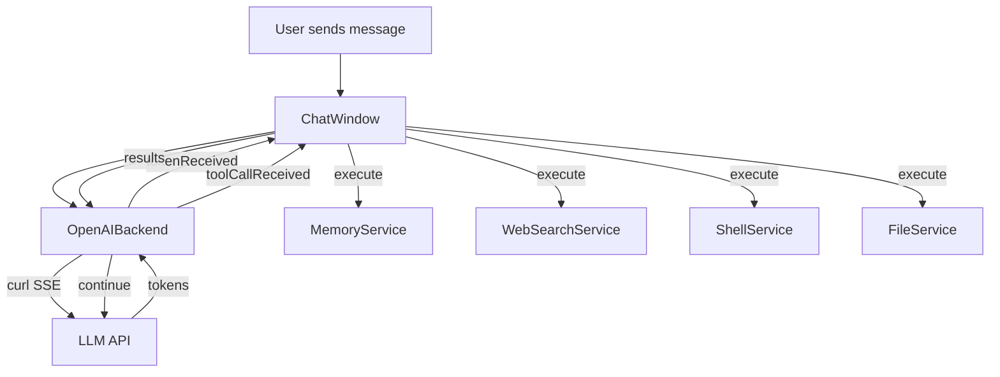

# Backend Implementation

How HyprChat orchestrates conversations, manages tools, and streams
responses. Everything is implemented in QML using QuickShell's
`Process` and `SplitParser` APIs.

## Architecture



## OpenAIBackend

A single QML component (`OpenAIBackend.qml`) that handles all LLM
communication. Works with any OpenAI-compatible API: GitHub Copilot,
OpenAI, Claude (via Copilot), Ollama.

### Streaming

Uses `curl` with SSE (Server-Sent Events) via `Process` +
`SplitParser` with `splitMarker: "\n\n"`:

1. Request body written to temp file via `Process` stdin
2. `curl -sN --no-buffer` streams the response
3. `SplitParser` splits on double-newline (SSE event boundary)
4. Each `data: {...}` line is parsed for `delta.content` (tokens)
   and `delta.tool_calls` (tool invocations)
5. Tokens emitted via `tokenReceived` signal
6. Tool calls accumulated and emitted via `toolCallReceived` on stream end

### System Prompt Assembly

The system prompt is assembled dynamically from:

1. **Profile system prompt** — user-configured per profile
2. **Memory instructions** — appended when memory is enabled
3. **Web search instructions** — appended when web search is enabled
4. **Shell instructions** — appended when shell is enabled
5. **File access instructions** — appended when file access is enabled

### Copilot Authentication

GitHub Copilot uses a multi-step flow:

1. OAuth device flow (`github.com/login/device/code`) → user authorizes in browser
2. OAuth token (`ghu_...`) stored in system keyring
3. Token exchanged at `api.github.com/copilot_internal/v2/token` → session token + API endpoint
4. Session token used for `/chat/completions` and `/models`
5. Auto-refresh when token expires

## Tool-Use Loop

`ChatWindow` owns the tool-use loop:

1. Backend streams response
2. If response contains tool calls → `toolCallReceived` fires
3. ChatWindow executes each tool (sync or async)
4. Tool results fed back via `backend.continueWithToolResults()`
5. Backend sends another request with results appended
6. Repeat until model responds with text only
7. Loop capped at 10 iterations

### Sync vs Async Tools

| Tool | Type | Service |
|------|------|---------|
| `memory_*` | Sync (from cache) | MemoryService |
| `web_search`, `web_read_page` | Async | WebSearchService |
| `shell_exec`, `shell_exec_background` | Async | ShellService |
| `fs_*` | Async | FileService |

Async tools use a pending state + signal pattern. When all async
results arrive, the conversation continues.

## Configuration

All configuration is in `~/.config/hyprchat/preferences.json`:

```jsonc
{
  // Active profile determines backend, model, and system prompt
  "active_profile": "Assistant",
  "profiles": [
    {
      "name": "Assistant",
      "icon": "🤖",
      "backend": "copilot",
      "model": "gpt-4o",
      "systemPrompt": "You are a helpful assistant. Be concise."
    }
  ],
  // Tool toggles
  "memory_enabled": true,
  "web_search_enabled": true,
  "shell_enabled": false,
  "file_access_enabled": true,
  "file_access_root": "/",
  // Context management
  "summarize_threshold": 0.7,
  "keep_recent_messages": 4,
  // Memory
  "memory_split_threshold": 200
}
```

API keys are stored in the system keyring via `secret-tool` (libsecret).
See [Authentication](authentication.md) for details.

## Preferences

`Preferences.qml` loads/saves the JSON config. All properties are
reactive — changes propagate immediately to the UI and backend.

Profiles are managed through the Preferences UI with auto-save on
edit. Global settings (tool toggles, thresholds) are saved on the
Preferences panel's Save button.

## Theme

`Theme.qml` loads colors from `~/.config/hyprchat/theme.jsonc`.
File is watched via `inotifywait` for live reload. See
[Frontend](frontend.md) for the theme file format.
