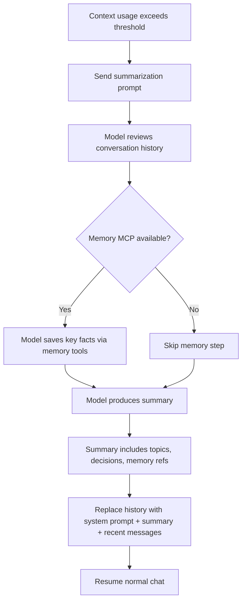

# Context Management

Strategy for managing conversation context as it approaches the
model's token limit.

## Overview

When a conversation grows large enough to approach the context window
limit, HyprChat performs a **memory-aware summarization**. This is
not simple truncation — it's a guided process that:

1. Writes important context to memory files (via Memory MCP)
2. Reorganizes memory if needed
3. Replaces the conversation history with a compact summary
4. Preserves references to relevant memory files in the summary

After summarization, the model has a high-level understanding of what
happened plus pointers to memory files it can read to restore full
detail on any topic.

## Trigger

Summarization is triggered when estimated token usage exceeds a
configurable threshold (default: 70% of the context window). This
leaves room for the summarization request itself and the model's
response.

```txt
Context usage > 70%
    ↓
Pause normal chat
    ↓
Run summarization flow
    ↓
Resume with compressed context
```

## Summarization Flow



## Summarization Prompt

The summarization is driven by a special system-level prompt sent
to the model. This prompt instructs the model to:

```txt
You are about to summarize this conversation because it is approaching
the context limit. Before summarizing:

1. SAVE TO MEMORY: Review the conversation for any important facts,
   preferences, decisions, or solutions that should be remembered
   long-term. Use memory_append to save them to appropriate topic
   files. If a memory file is getting large, use memory_reorganize
   to split it.

2. SUMMARIZE: Write a concise summary of the conversation that
   includes:
   - What topics were discussed
   - Key decisions or conclusions reached
   - Current state of any ongoing tasks
   - References to memory files where details are stored
     (format: [memory:topic_name])

3. KEEP REFERENCES: For each topic you saved to memory, include a
   reference in the summary so you can read the full details later
   if needed.

The summary should be compact but sufficient to continue the
conversation naturally. The user should not notice a loss of context.
```

## After Summarization

The conversation history is replaced with:

| Position | Content |
| -------- | ------- |
| 1 | System prompt (unchanged) |
| 2 | Summary message (role: `system`, contains the summary + memory refs) |
| 3 | Last 2-4 messages from the conversation (preserves immediate context) |

This brings token usage down to roughly 10-15% of the context window,
leaving room for the conversation to continue.

### Memory References in Summary

The summary contains explicit references to memory files:

```txt
## Conversation Summary

We discussed setting up HyprChat, a QuickShell-based AI chat panel.
Key work included:
- Implementing the Copilot OAuth device flow [memory:hyprchat/auth]
- Setting up gnome-keyring for secret storage [memory:linux/keyring]
- Building the streaming SSE backend [memory:hyprchat/backend]
- Configuring the model switcher UI [memory:hyprchat/ui]

Current task: implementing context management and memory integration.

The user prefers concise responses and uses Hyprland on CachyOS.
[memory:preferences]
```

When the model needs detail on any topic, it can call `memory_read`
with the referenced topic to restore full context.

## Configuration

```json
{
  "context_management": {
    "summarize_threshold": 0.7,
    "keep_recent_messages": 4,
    "auto_summarize": true
  }
}
```

- `summarize_threshold` — trigger summarization at this fraction of
  the context window (0.7 = 70%)
- `keep_recent_messages` — number of recent messages to preserve
  after summarization (in addition to the summary)
- `auto_summarize` — if false, show a prompt asking the user to
  confirm before summarizing

## User Experience

- The context gauge shows usage approaching the threshold
- When auto-summarization triggers, a brief "Summarizing..." indicator
  appears
- The conversation continues seamlessly — the user may notice older
  messages disappear from the view, replaced by a summary block
- The summary block is visually distinct (different style/color) so
  the user knows it's a compressed history
- The user can expand the summary to see its contents

## Relationship to Memory

This feature depends on the [Memory MCP](mcp-memory.md) being
enabled. If memory is disabled for the conversation:

- Summarization still works, but without the memory-write step
- The summary is purely in-context with no external persistence
- Quality is lower because the model can't offload details to files

When memory is enabled, summarization becomes a **checkpoint
operation** — the model saves everything important to memory files
before compressing the conversation. Even if the user starts a new
chat later, that context is preserved in memory.

## Implementation Notes

- The summarization request is a separate `backend.send()` call with
  a modified message list that includes the summarization prompt
- The model's response (the summary) is parsed and used to replace
  the conversation history
- Memory tool calls during summarization follow the normal tool-use
  loop — `ChatService` executes them via `McpClient`
- The summarization itself consumes tokens, so the threshold must
  leave enough room (~30% of context) for the summarization exchange

## Open Questions

- **Summarization quality** — how well do different models handle the
  guided summarization prompt? May need model-specific tuning.
- **Transparency** — should the user be able to see/edit the summary
  before it replaces the history?
- **Multiple summaries** — in very long sessions, summarization may
  need to happen more than once. Each round compresses further.
  How many rounds before quality degrades too much?
- **Summary of summaries** — when re-summarizing, the model is
  summarizing a summary. Should we prevent this by always reading
  memory files for full context before producing a new summary?
