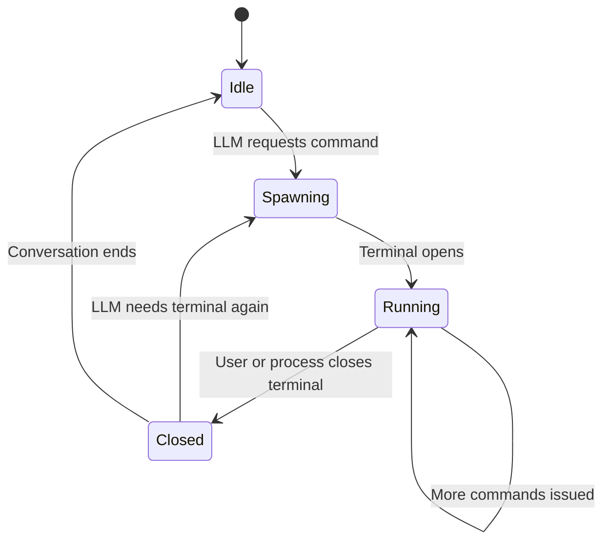

# Shell MCP

Terminal command execution for the LLM via MCP.

## Purpose

Lets the model run shell commands to answer questions, install packages,
check system state, run builds, execute scripts, etc. The terminal is
a real compositor-managed window — the user can see exactly what's
being executed.

## Design

### Spawned Terminal Window

When the LLM invokes a shell tool, the MCP server spawns an actual
terminal emulator process (e.g. `foot`, `kitty`, `alacritty` —
configurable). The compositor places the terminal window like any
other window — the user sees it, can interact with it, and can
close it.

HyprChat tracks the terminal's lifecycle:



### Session Model

- **One terminal per conversation** — the first shell tool call spawns
  it, subsequent calls reuse the same terminal
- **Persistent shell session** — state (cwd, env vars, history)
  carries across tool calls within the conversation
- **Auto-respawn** — if the user closes the terminal and the LLM
  issues another command, a new terminal is spawned automatically
- **Cleanup** — when the conversation ends or HyprChat is toggled
  closed, the terminal can optionally be killed or left running
  (configurable)

### Terminal Tracking

HyprChat monitors the terminal process via:

- **PID tracking** — `QProcess` tracks the spawned terminal's PID
- **Hyprland IPC** — listen for `closewindow` events on socket2 to
  detect when the user closes the terminal window
- **Window class matching** — the spawned terminal is given a
  distinctive class (e.g. `hyprchat-shell`) so HyprChat can
  identify it among other windows

## Tools Exposed

| Tool | Description | Parameters |
| ---- | ----------- | ---------- |
| `shell_exec` | Execute a command in the terminal | `command` (string) |
| `shell_exec_background` | Execute a command without waiting for output | `command` (string) |
| `shell_read_output` | Read recent output from the terminal | `lines` (int, optional) |
| `shell_is_running` | Check if the terminal session is alive | _(none)_ |

### Behavior

- `shell_exec` — writes the command to the terminal's stdin, waits
  for completion, returns stdout/stderr. Timeout configurable
  (default: 30s).
- `shell_exec_background` — writes the command but doesn't wait.
  Useful for starting servers or long-running processes.
- `shell_read_output` — reads the last N lines from the terminal's
  output buffer. Useful after background commands.
- `shell_is_running` — returns whether the terminal process is alive.

## Communication

The MCP server doesn't just spawn a terminal — it needs to capture
output. Two approaches:

1. **PTY-based** — the MCP server creates a pseudoterminal, runs the
   shell inside it, and pipes the PTY to the terminal emulator via
   its stdin/stdout. This gives full control over input/output while
   the terminal emulator provides the visual window.

2. **Script/exec wrapper** — run commands via a wrapper script that
   tees output to a file the MCP server reads back. Simpler but
   less reliable.

PTY-based is the recommended approach. C++ has good POSIX PTY support
(`forkpty`, `openpty`).

## Configuration

```json
{
  "mcp": {
    "shell": {
      "terminal": "foot",
      "shell": "/bin/fish",
      "timeout": 30,
      "cleanup_on_close": true,
      "window_class": "hyprchat-shell"
    }
  }
}
```

- `terminal` — terminal emulator to spawn
- `shell` — shell to run inside the terminal
- `timeout` — default command timeout in seconds
- `cleanup_on_close` — kill the terminal when the conversation ends
- `window_class` — Hyprland window class for identification

## Security

- **User-visible** — all commands run in a visible terminal the user
  can observe. No hidden execution.
- **No root** — runs as the current user. No privilege escalation.
- **Timeout** — commands that hang are killed after the configured
  timeout.
- **Confirmation** — optionally require user confirmation before
  executing commands (configurable, off by default for speed).

## Open Questions

- **Output capture reliability** — PTY approach is robust but complex.
  Worth prototyping early.
- **Terminal emulator compatibility** — does `foot` / `kitty` /
  `alacritty` all behave the same when given stdin/stdout pipes?
- **Concurrent commands** — should the LLM be able to run multiple
  commands in parallel, or strictly sequential?
- **Sandboxing** — worth considering `bubblewrap` or similar for
  restricting what the LLM can do? Or trust the user's judgment
  since they see everything?
