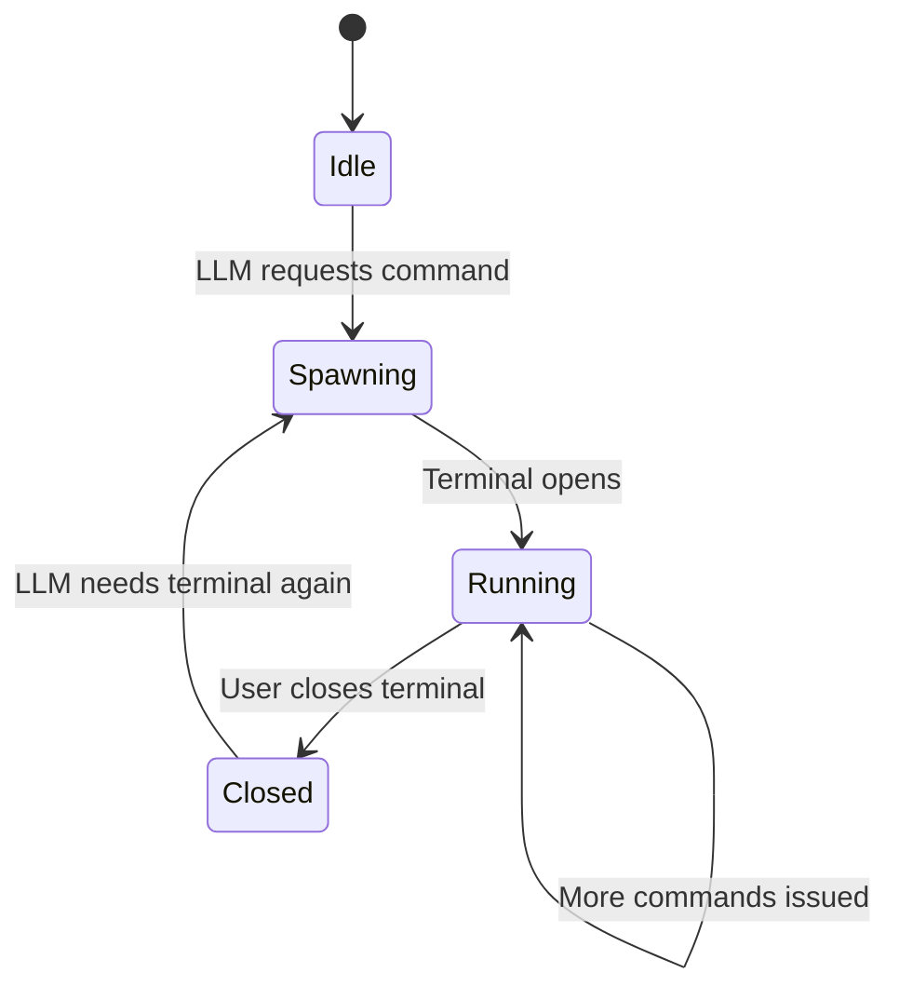

# Shell MCP

Terminal command execution for the LLM.

## Purpose

Lets the model run shell commands to answer questions, install packages,
check system state, run builds, execute scripts, etc. The terminal is
a real compositor-managed window — the user can see exactly what's
being executed.

## Design

Uses kitty terminal emulator with remote control:

- Spawns kitty with `--listen-on unix:/tmp/hyprchat-kitty.sock`
- Installs a postcmd hook (fish/zsh/bash) that touches a signal file
- `inotifywait` detects the signal file change instantly
- Captures terminal buffer before/after command to extract output
- Diffs buffers to isolate only the new output

## Tools Exposed

| Tool | Description | Parameters |
| ---- | ----------- | ---------- |
| `shell_exec` | Execute a command and return output | `command` (string) |
| `shell_exec_background` | Execute without waiting for output | `command` (string) |

### Behavior

- `shell_exec` — sends command, waits for postcmd hook, captures
  output. Timeout: 30s. Output truncated at 10,000 chars.
- `shell_exec_background` — sends command, returns immediately.
  Useful for servers or long-running tasks.

## Security

- **User-visible** — all commands run in a visible terminal
- **No root** — runs as the current user
- **Timeout** — commands killed after 30s
- **ANSI stripping** — output cleaned of escape codes

## Implementation

`ShellExecutor.cs` in the NativeAOT backend. Uses `System.Diagnostics.Process`
to spawn kitty and communicate via its remote control socket.
