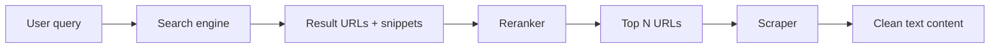

# Web MCP

Internet search and page retrieval for the LLM via MCP.

## Purpose

Lets the model search the web and read page content to answer questions
that require up-to-date information, documentation lookups, or
external references.

## Design

### Pipeline



1. **Search** — query a search engine, get a list of result URLs
   with titles and snippets
2. **Rerank** — score results by relevance to the original query,
   pick the top N
3. **Scrape** — fetch the selected pages and extract clean text
   (strip HTML, ads, nav, etc.)
4. **Return** — return the extracted content to the LLM as tool output

### Search Backend

Options for the search step:

| Option | Pros | Cons |
| ------ | ---- | ---- |
| **SearXNG** (self-hosted) | Private, no API key, configurable | Requires running an instance |
| **Brave Search API** | Good privacy, generous free tier | API key required |
| **Google Custom Search** | Comprehensive results | API key, rate limits |
| **DuckDuckGo** | No API key needed | Unofficial API, fragile |

SearXNG is the natural fit for a self-hosted Hyprland setup. Can run
as a local container or system service.

### Reranking

Reranking sorts search results by actual relevance to the query,
beyond what the search engine provides. Options:

| Option | Description |
| ------ | ----------- |
| **Keyword/TF-IDF** | Simple C++ implementation, no dependencies. Score snippets by term overlap with the query. Fast, reasonable quality. |
| **Cross-encoder model** | Run a small reranker model (e.g. via ONNX Runtime C++ API). Better quality, heavier dependency. |
| **LLM-based** | Send snippets back to the LLM and ask it to pick the best ones. Uses tokens but no extra dependencies. |

Start with keyword-based reranking. Upgrade to a cross-encoder later
if result quality is insufficient.

### Scraping

Extract readable text from HTML pages. C++ libraries:

| Library | Description |
| ------- | ----------- |
| **libxml2 / libhtml** | Parse HTML into DOM, traverse and extract text nodes. Widely available, C API. |
| **Gumbo** (Google) | HTML5 parser, produces a parse tree. Clean C API, easy to walk. |
| **lexbor** | Fast HTML parser, modern C. Good for extraction tasks. |

The scraper needs to:

- Fetch the page via `QNetworkAccessManager`
- Parse HTML into a DOM
- Extract main content (heuristics: largest text block, `<article>`,
  `<main>`, or readability-style extraction)
- Strip scripts, styles, nav, footer, ads
- Return clean plaintext or light markdown

A readability-style algorithm (similar to Mozilla's Readability.js)
ported to C++ would be ideal. Alternatively, call a Node.js script
with Readability.js via `QProcess` if purity isn't a concern.

## Tools Exposed

| Tool | Description | Parameters |
| ---- | ----------- | ---------- |
| `web_search` | Search the web and return results | `query` (string), `num_results` (int, optional) |
| `web_read_page` | Fetch and extract text from a URL | `url` (string) |

### Behavior

- `web_search` — queries the configured search backend, reranks
  results, returns top N as a list of `{title, url, snippet}`.
  Default N = 5.
- `web_read_page` — fetches the URL, extracts clean text content,
  returns it. Truncates to a configurable max length (default: ~4000
  tokens worth of text) to avoid blowing the context window.

## Configuration

```json
{
  "mcp": {
    "web": {
      "search_backend": "searxng",
      "searxng_url": "http://localhost:8080",
      "max_results": 5,
      "max_page_length": 8000,
      "user_agent": "HyprChat/1.0"
    }
  }
}
```

- `search_backend` — which search provider to use
- `searxng_url` — URL of the SearXNG instance (if applicable)
- `max_results` — number of results to return from search
- `max_page_length` — max characters to return from a scraped page
- `user_agent` — HTTP user agent for page fetching

## Security

- **No credential leaking** — search queries and fetched URLs are
  visible to the LLM but not persisted unless memory is enabled
- **URL validation** — block loopback/private IPs to prevent SSRF
  (no fetching `localhost`, `127.0.0.1`, `10.x.x.x`, etc. unless
  the target is the configured SearXNG instance)
- **Content sanitization** — extracted text is plaintext, no script
  execution
- **Rate limiting** — configurable delay between fetches to avoid
  hammering sites

## Open Questions

- **Search backend choice** — SearXNG is ideal but requires setup.
  Ship a docker-compose or systemd service? Or default to an API-
  based backend that works out of the box?
- **Reranker complexity** — is keyword scoring good enough, or does
  this need a proper ML model from the start?
- **Readability extraction** — port Readability.js to C++, wrap it
  via `QProcess`, or use a simpler heuristic?
- **Caching** — cache scraped pages for the duration of a
  conversation to avoid re-fetching?
- **robots.txt** — respect it? The LLM is acting as a user agent,
  similar to a browser.
