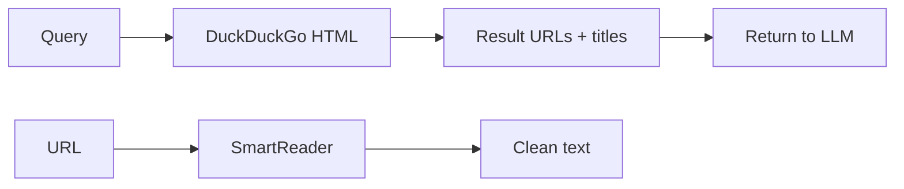

# Web MCP

Internet search and page retrieval for the LLM.

## Purpose

Lets the model search the web and read page content for up-to-date
information, documentation lookups, or external references.

## Pipeline

### Search

Queries DuckDuckGo's HTML endpoint via `HttpClient`. Parses result
links and titles from the HTML response using regex. Extracts actual
URLs from DDG redirect parameters. Returns up to 8 results.

### Page Extraction

Primary: **SmartReader** (C# port of Mozilla's Readability.js) via
AngleSharp. Extracts article content as clean text.

Fallback: Raw HTML fetch with tag stripping, entity decoding, and
whitespace normalization.

Page content truncated to 8,000 characters.

## Tools Exposed

| Tool | Description | Parameters |
| ---- | ----------- | ---------- |
| `web_search` | Search DuckDuckGo for results | `query` (string) |
| `web_read_page` | Fetch and extract text from a URL | `url` (string) |

## Security

- **TLS verification disabled** — for corporate proxy compatibility
- **Content sanitization** — extracted text is plaintext only
- **Truncation** — page content capped at 8,000 chars

## Implementation

`WebService.cs` in the NativeAOT backend. Uses `HttpClient` for
fetching and `SmartReader` + `AngleSharp` for content extraction.
No Node.js dependency.
