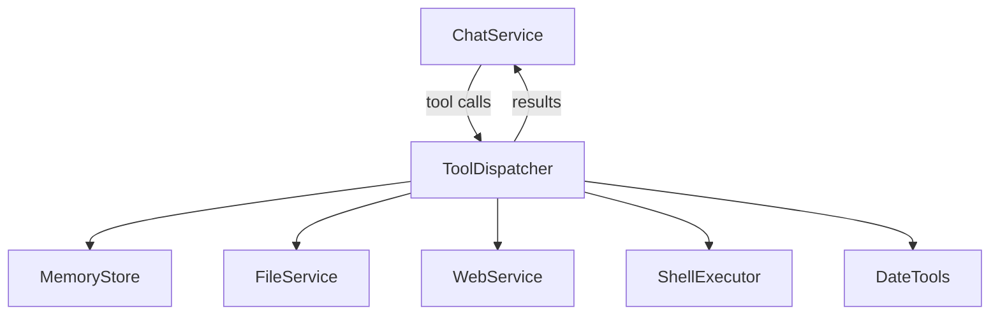

# MCP Support

Model Context Protocol tools for HyprChat.

## Overview

HyprChat gives the LLM access to local tools for file access,
persistent memory, web search, shell commands, and date/time.

All tools are implemented inside the NativeAOT .NET backend binary.
Tool definitions follow the OpenAI function calling format. The
backend handles the entire tool-use loop internally — the QML
frontend only renders tool call/result notifications.

## Architecture



### Tool Execution Flow

1. LLM responds with tool calls (parsed from SSE stream)
2. `ChatService` passes each to `ToolDispatcher`
3. `ToolDispatcher` routes by tool name to the appropriate service
4. Service executes and returns a result string
5. Result appended to message history as a `tool` role message
6. `ChatService` sends another request to the LLM with results
7. Repeat until model responds with text only

## Configured Tools

| Server | Purpose | Details |
| ------ | ------- | ------- |
| [File System](mcp-filesystem.md) | Read/write file access | Scoped to configured root |
| [Memory](mcp-memory.md) | Persistent encrypted memory | Topic-based markdown files |
| [Shell](mcp-shell.md) | Terminal command execution | Via kitty remote control |
| [Web](mcp-web.md) | Internet search and scraping | DuckDuckGo + SmartReader |
| [Date & Time](mcp-date.md) | Real-time date/time tools | Pure computation |

## Configuration

Tools are toggled in `~/.config/hyprchat/preferences.json`:

```json
{
  "memory_enabled": true,
  "web_search_enabled": true,
  "shell_enabled": false,
  "file_access_enabled": true,
  "date_enabled": true,
  "file_access_root": "/"
}
```
