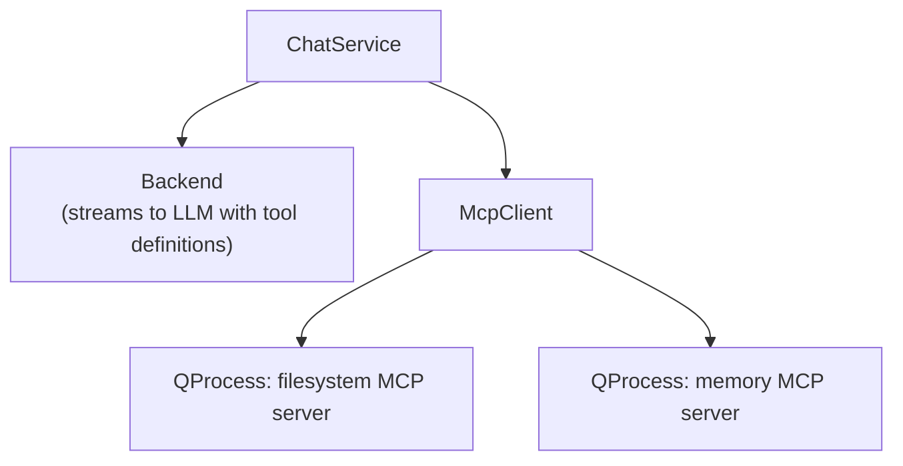

# MCP Support

Model Context Protocol integration for HyprChat.

## Overview

HyprChat uses MCP to give the LLM access to local tools — reading
files, managing persistent memory, and potentially more in the future.

MCP servers run as local child processes. HyprChat's `McpClient`
spawns each server, communicates over stdin/stdout JSON-RPC, and
exposes discovered tools to the LLM through the backend's tool-calling
interface.

## Architecture



### Startup Flow

1. `McpClient` reads MCP server config from `config.json`
2. Spawns each configured server as a `QProcess`
3. Sends `initialize` to each server
4. Calls `tools/list` to discover available tools
5. Converts responses into `ToolDefinition` objects
6. `ChatService` collects all tool definitions and passes them to
   the active backend on each `stream()` call

### Tool Execution Flow

1. LLM responds with a tool call (parsed by the backend)
2. `ChatService` receives `toolCallRequested` signal
3. Routes to the correct MCP server based on tool name
4. Sends `tools/call` with the tool name and arguments
5. Reads the result from the server's stdout
6. Wraps result in a `ToolResult` and appends to message history
7. Calls `stream()` again so the LLM can continue

## Configured Servers

| Server | Purpose | Details |
| ------ | ------- | ------- |
| [File System MCP](mcp-filesystem.md) | Read-only file access | Scoped to configured directories |
| [Memory MCP](mcp-memory.md) | Persistent memory | Read/append markdown files by topic |

## Configuration

MCP servers are configured in `~/.config/hyprchat/config.json`:

```json
{
  "mcp": {
    "filesystem": {
      "roots": ["~/Dev", "~/Documents"]
    },
    "memory": {
      "path": "~/.config/hyprchat/memory"
    }
  }
}
```

## Transport

All MCP communication uses stdio (stdin/stdout JSON-RPC):

- Simple — no HTTP server, no ports, no auth
- Secure — child processes inherit only what's needed
- Standard — follows the MCP specification for stdio transport
