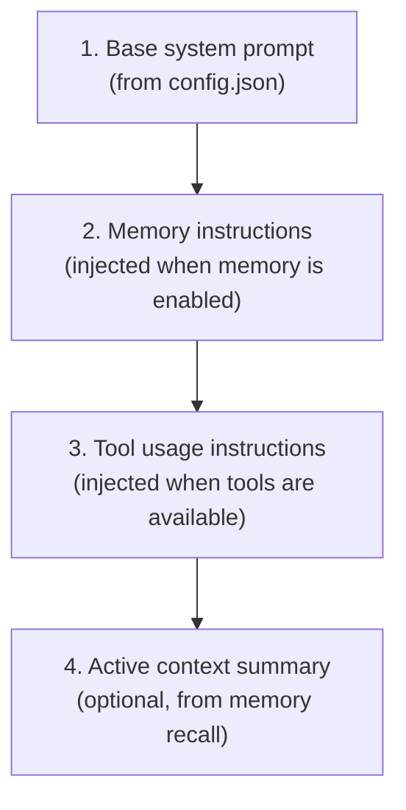

# System Prompt

How HyprChat constructs the system prompt sent to the LLM.

## Structure

The system prompt is assembled from multiple parts before each
conversation turn. The final prompt sent to the backend is a
concatenation of:



## 1. Base System Prompt

User-configurable in `~/.config/hyprchat/config.json`:

```json
{
  "system_prompt": "You are a helpful assistant. Be concise."
}
```

This is always the first part of the system prompt. Kept short — the
user controls tone and personality here.

## 2. Memory Instructions

Appended automatically when memory is enabled for the conversation.
Tells the LLM how and when to use memory tools:

```txt
You have access to a persistent memory system. Use it proactively:

READING MEMORY:
- At the start of each conversation, check relevant memory topics
  for context about the user and their preferences.
- Before answering questions about topics you've discussed before,
  read the relevant memory file.
- Use memory_list_topics to see what's available, then memory_read
  for relevant topics.

WRITING MEMORY:
- When you learn something new about the user (preferences, patterns,
  environment, projects), save it immediately using memory_append.
- When the user corrects you, update memory so you don't repeat
  the mistake.
- When you discover a useful fact during the conversation (a working
  command, a solution to a problem), save it.
- Be selective — save facts and preferences, not conversation
  transcripts.

Keep memory entries concise. Use bullet points. Include dates for
time-sensitive information.
```

This block is **omitted entirely** when memory is toggled off for a
conversation. The LLM never sees memory tools or instructions.

## 3. Tool Usage Instructions

Appended when any tools are available (memory, filesystem, or both):

```txt
You have tools available. Use them when they would help answer the
user's question accurately. Don't ask permission to use tools —
just use them. If a tool call fails, report the error briefly and
continue.
```

## 4. Active Context Summary

Optional. When memory is enabled and `ChatService` performs an
automatic memory recall at conversation start (see
[Memory Management](memory-management.md)), a summary of relevant
memory is prepended to the conversation as context:

```txt
[Recalled from memory]
- User runs Hyprland on Arch Linux
- Preferred editor: Neovim
- Working on: theme engine, HyprChat
```

This reduces the need for the LLM to make a tool call on the first
message — the most relevant memory is already loaded.

## Assembly

`ChatService` assembles the prompt before calling `backend.stream()`:

```cpp
QString buildSystemPrompt(bool memoryEnabled, bool toolsAvailable) {
    QString prompt = config.systemPrompt;

    if (memoryEnabled)
        prompt += "\n\n" + memoryInstructions;

    if (toolsAvailable)
        prompt += "\n\n" + toolUsageInstructions;

    return prompt;
}
```

The system prompt is the first message in the `messages` list sent
to every backend, with role `system`.

## Customization

The base prompt is fully user-controlled. The memory and tool
instruction blocks are built-in but could be made configurable in
the future if users want to override the default phrasing.

The key design choice: memory instructions are **prescriptive**,
they tell the LLM to use memory proactively rather than waiting
to be asked. This ensures memory accumulates naturally over time
without the user having to say "remember this."
